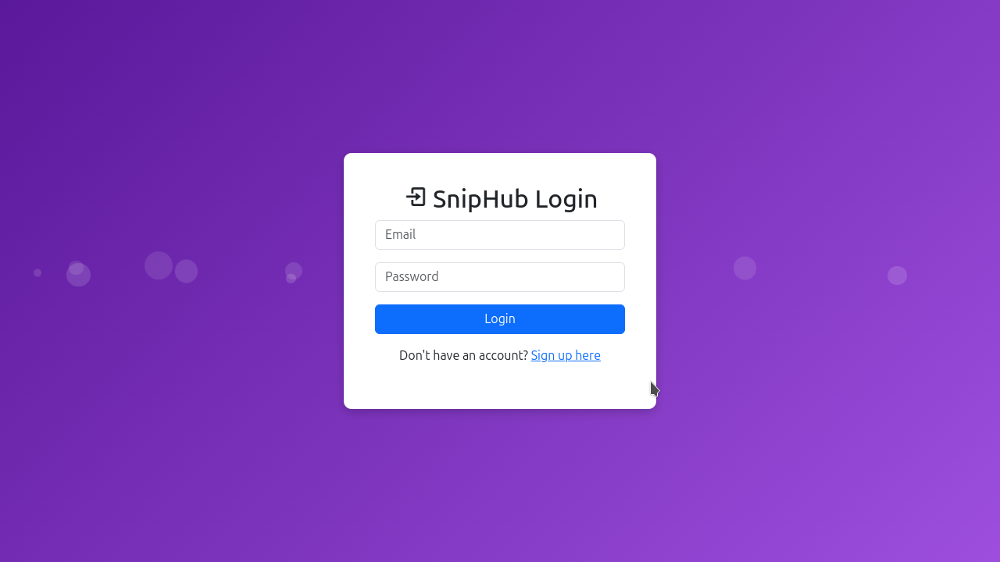
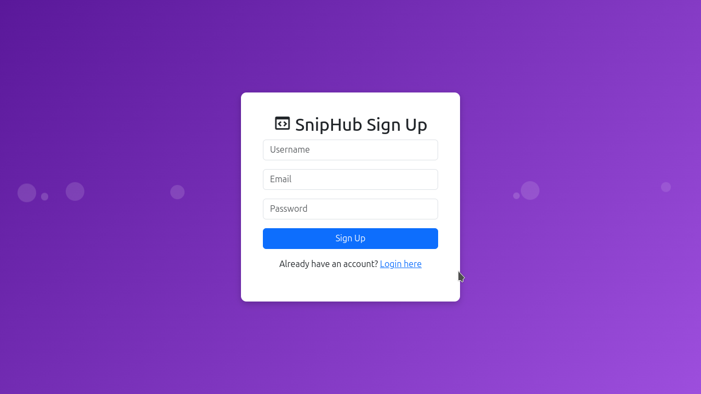
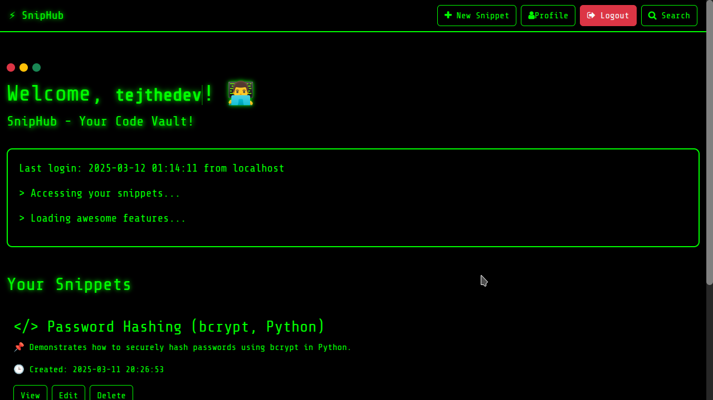
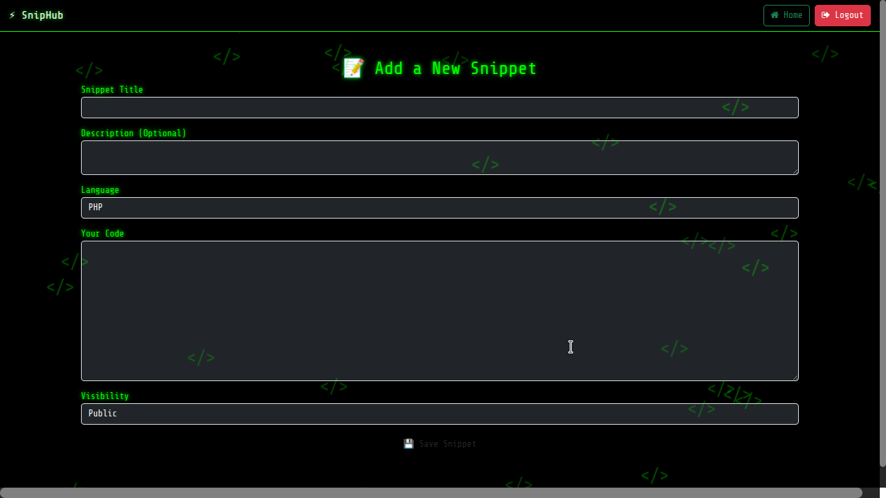
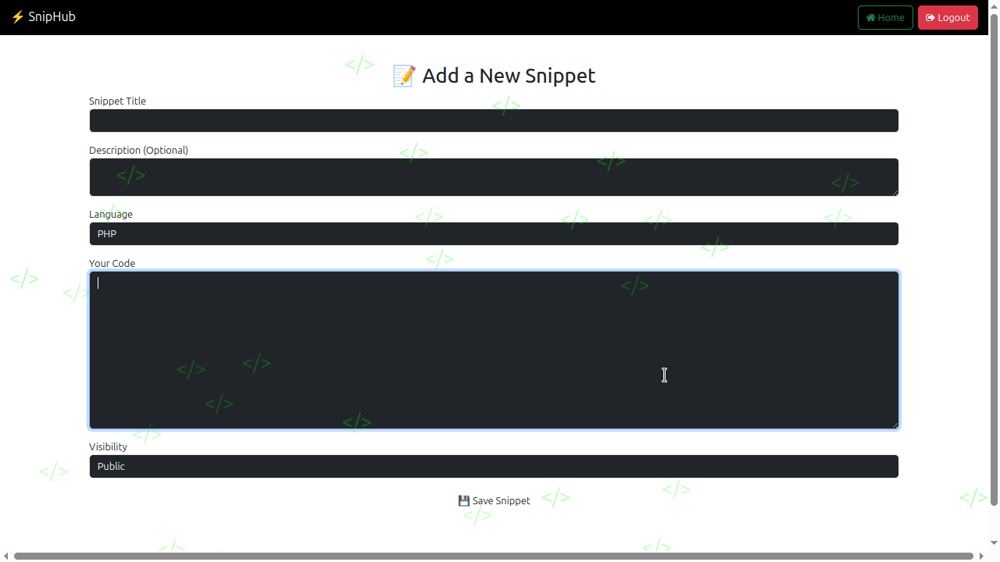
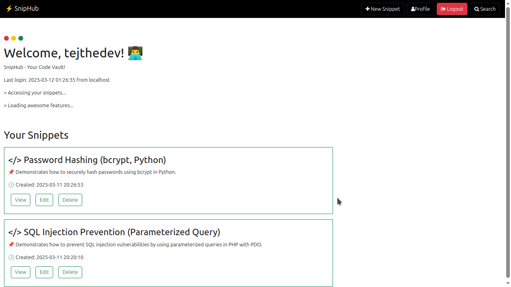

# SnipHub - Your Code Vault ⚡

SnipHub is a **basic yet powerful** web app designed to store and manage code snippets efficiently. It provides a **minimalist dashboard**, search functionality, and essential CRUD operations for organizing code.

---

## 🚀 Features
- **User Authentication** (Login & Logout)
- **Snippet Management** (Create, Read, Update, Delete)
- **Search Functionality** (Find snippets instantly)
- **Terminal-Like UI** (Hacker aesthetic for coding vibes)
- **Smooth Animations** (Minimal but effective)

---

## 🛠️ Tech Stack
### Backend:
- **PHP** (Core logic & session handling)
- **MySQL** (Database for storing snippets)

### Frontend:
- **Bootstrap 5** (Styling & UI components)
- **jQuery** (AJAX for interactivity)
- **FontAwesome & Boxicons** (Icons & visuals)

### External Libraries:
- **Bootstrap** (UI framework)
- **jQuery** (JavaScript utility)

---

## 🏗 Installation Guide
1. Clone the repo:
   ```sh
   git clone https://github.com/tejHacks/snipHub.git
   ```
2. Navigate into the project:
   ```sh
   cd snipHub
   ```
3. Set up the database:
   - Import `database.sql` into MySQL
   - Configure `config/db.php` with your database credentials
4. Start a local server (XAMPP/LAMP/WAMP):
   ```sh
   php -S localhost:8000
   ```
5. Open your browser and visit:
   ```
   http://localhost:8000
   ```

---

## 📖 Usage Instructions
- **Login/Register** to access your snippets
- **Create** a new snippet from the dashboard
- **Edit/Delete** snippets with ease
- **Search** your saved snippets for quick access

---

## Screenshots of the app









 


## 🔥 Future Enhancements
- **Syntax Highlighting** for code snippets
- **Tagging System** for better snippet organization
- **Dark/Light Theme Toggle**
- **Export/Import Snippets** as JSON or CSV
- **API Support** to integrate with external apps
- **Modular Hacker and Light Theme** switch between both themes and Implement Local storage in the app for theme switch

---

## 🤝 Contributing
Feel free to fork this repo and submit pull requests! 🚀

---

## 📜 License
This project is open-source under the **MIT License**.

---

Made with ❤️ by Tejthedev

